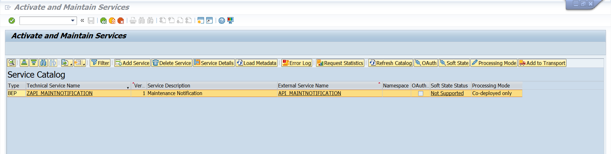

## Check SAP S/4HANA Readiness
In this section, you will activate the APIs related to plant maintenance notification for this scenario.
API_MAINTNOTIFICATION API is supported from SAP S/4HANA 2022 onwards.

### Activate the API_MAINTNOTIFICATION Service

1. In your SAP S/4HANA system, open the **/n/IWFND/MAINT_SERVICE** trasaction.

2. Activate the API_MAINTNOTIFICATION service.

   

Based on your business scenario, expose the respective APIs (For example, create plant maintenance notification etc.).

In the next step, you can choose to either setup cloud connector or SAP Private Link Service based on the SAP S/4HANA installation.
