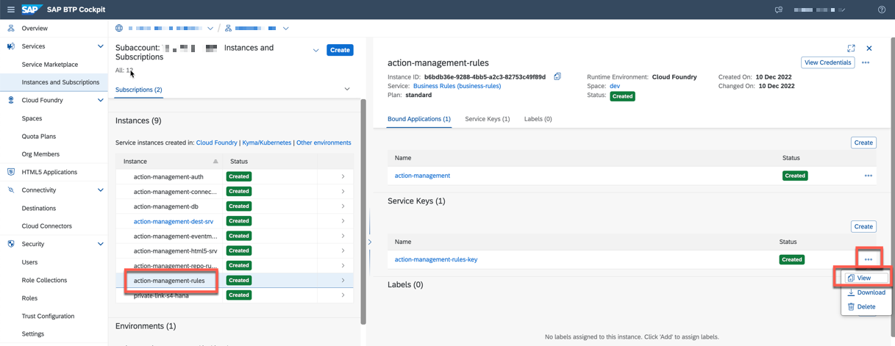
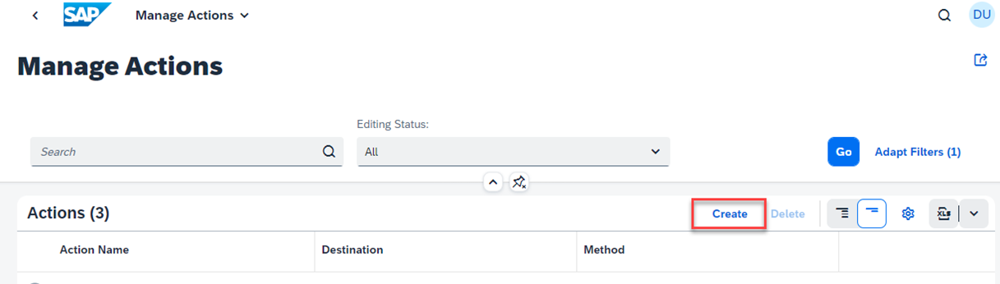
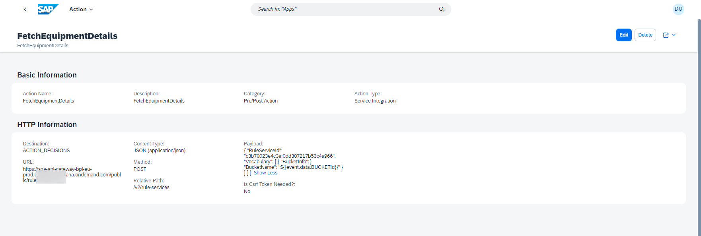
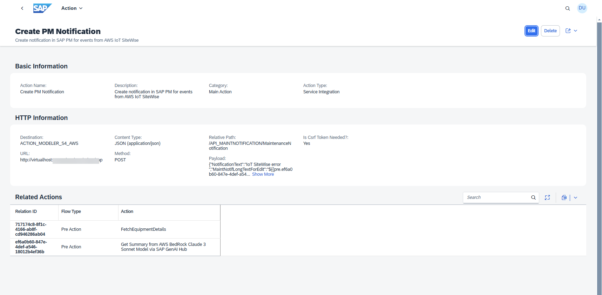

## Configure SAP S/4HANA Business Actions in the extension application

In this section, you will define business action in the action-management extension application in SAP BTP. Ensure your application's **Requested State** is **Started**.

### 1. Create Destinations

1. In the SAP BTP cockpit, navigate to your subaccount and choose **Instances and Subscriptions** and then choose **Instances**.

    

2. Choose **action-management-rules** and then choose the three dots next to **action-management-rules-key** and then choose **View** to open the service key.

    

3. Copy the values of **clientid**, **clientsecret**, **url** and **rule_runtime_url**.

    

4. In the SAP BTP cockpit, navigate to your subaccount and choose **Connectivity > Destinations**.

    

5. Create a new destination with the name **ACTION_BUSINESS_RULES** and enter the following configuration values. This is used for calling SAP Business Rules.

    - Copy the values of rule_runtime_url, clientid, clientsecret and url from Step 2 and update it for URL, Client ID, Client Secret and Token Service URL.

    ```
    Name: ACTION_BUSINESS_RULES
    Type: HTTP
    URL: <rule_runtime_url>/rules-service/rest/v2
    Proxy: Internet
    Authentication: OAuth2ClientCredentials
    Client ID: <clientid>
    Client Secret: <clientsercret>
    Token Service URL Type: Dedicated
    Token Service URL: <url>/oauth/token

    Additional Properties:
    HTML5.DynamicDestination: true
    ```

    Your destination configuration should look like this:

    

6. Create destination with the name **ACTION_MODELER_S4** and enter the following configuration values.

    Change host name in URL, User, Password as per your SAP S/4HANA system details.

    - In case of SAP S/4HANA system on AWS Private Cloud, choose **Proxy Type** as **PrivateLink** and the private link **hostname** copied from [Step3b-Setup-SAPPrivateLinkService](../Step3b-Setup-SAPPrivateLinkService/README.md) in the **hostname** field.

        ```
        Name: ACTION_MODELER_S4
        Type: HTTP
        URL: https://<hostname>/sap/opu/odata/sap
        Proxy Type: PrivateLink
        Authentication: BasicAuthentication
        User: <SAP S4HANA User>
        Password: <SAP S4HANA Password>

        Additional Properties:
        HTML5.DynamicDestination: true
        WebIDEEnabled: true
        WebIDEUsage: odata_abap
        TrustAll: true
        ```

        Your destination configuration should look like this:

        

    - In case of SAP S/4HANA On-Premise system, choose **Proxy Type** as **OnPremise** and use the **Virtual Host**:**Virtual Port** in the **hostname** placeholder below created at [Step3a-SetupCloudConnector](../Step3a-SetupCloudConnector/README.md) to connect using Cloud Connector.

        ```
        Name: ACTION_MODELER_S4
        Type: HTTP
        URL: https://<hostname>/sap/opu/odata/sap
        Proxy Type: OnPremise
        Authentication: BasicAuthentication
        User: <SAP S4HANA User>
        Password: <SAP S4HANA Password>

        Additional Properties:
        HTML5.DynamicDestination: true
        WebIDEEnabled: true
        WebIDEUsage: odata_abap
        ```

        Your destination configuration should look like this:

        

### 2. Configure Business Actions in  Manage Actions application

In this section, you will configure the different business actions that needs to be executed based on the event received.

1. In the SAP BTP cockpit, navigate to your subaccount and choose **Cloud Foundry** > **Spaces**.  Choose your space and then choose **action-management** application. Choose the url provided under **Application Routes** section.

    

2. Choose **Manage Actions** tile.

    

3. Choose **Create** to create default action entry.

    

    

4. In the **Basic Information** section, enter the following configuration values.

    ```
    Action Name: Determine Action from Event Information
    Description: Determine Action from Event Information
    Category: Default Action
    Action Type: Service Integration
    ```

5. In the **HTTP Information** section, enter the following configuration values.

    **Note**: Replace **Rule Service ID** with the value copied from Create Business Rules Project section of the **Step6-Configure-BusinessRules-Part1** page.

    ```
    Destination: ACTION_BUSINESS_RULES
    Content-Type: application/json
    Method: POST
    Relative Path: /workingset-rule-services
    Payload: { "RuleServiceId": "<RulesServiceID>","Vocabulary": [ { "EventInfo":{ "SourceSystem": "${{event.data.SourceSystem}}","DeviceLocation": "${{event.data.DeviceLocation}}","DeviceType": "${{event.data.DeviceType}}" } } ] }
    Action Id Path in Response: Result[0].ActionInfo.ActionId
    ```

    Your configuration should look like this:

    

6. Choose **Create**.

7. Create another business action with name **FetchEquipmentDetails** and enter the following configuration values.

```
    Basic Information:

    Action Name: FetchEquipmentDetails
    Description: FetchEquipmentDetails
    Category: Pre/Post Action
    Action Type: Service Integration
    
    HTTP Information:
    Destination: ACTION_BUSINESS_RULES
    Content-Type: application/json
    Method: POST
    Relative Path: /workingset-rule-services
    Payload: { "RuleServiceId": "2c63b92dc775482682d230d031b14b1a", "Vocabulary": [ { "BucketInfo":{ "BucketName": "${{event.data.BUCKETId}}" } } ] }

    Is Csrf Token Needed?: false

```

Your configuration should look like this:



8. Create another business action with name **Create PM Notification** and enter the following  configuration values.

```
    Basic Information:

    Action Name: Create PM Notification
    Description: Create notification in SAP PM for Monitron
    Category: Main Action
    Action Type: Service Integration
    
    HTTP Information:
    Destination: ACTION_MODELER_S4
    Content-Type: application/json
    Method: POST
    Relative Path: /API_MAINTNOTIFICATION/MaintenanceNotification
    Payload: {
        
    "NotificationText":"Monitron error ",
    "MaintNotifLongTextForEdit":"Needs Maintenance, Monitron location: ${{pre.717174c8-8f1c-4166-ab8f-cd946286ab04.Result[0].EquipmentDetails.Location}} and equipment: ${{pre.717174c8-8f1c-4166-ab8f-cd946286ab04.Result[0].EquipmentDetails.Equipment}}",
    "NotificationType": "M1","TechnicalObject": "${{pre.717174c8-8f1c-4166-ab8f-cd946286ab04.Result[0].EquipmentDetails.Equipment}}",
    "TechObjIsEquipOrFuncnlLoc": "EAMS_EQUI",
    "TechnicalObjectLabel": "${{pre.717174c8-8f1c-4166-ab8f-cd946286ab04.Result[0].EquipmentDetails.Equipment}}"

    }
    Is Csrf Token Needed?: true

    Related Actions: 
    Flow Type: Pre Action
    Action: FetchEquipmentDetails
```

Your configuration should look like this:


