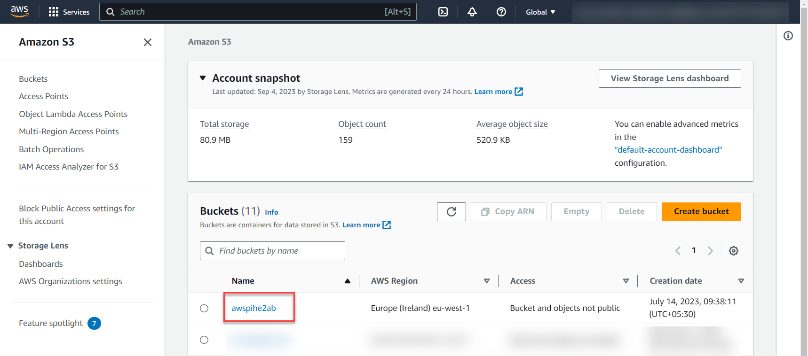
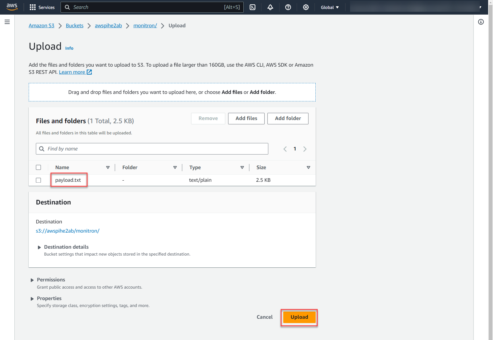
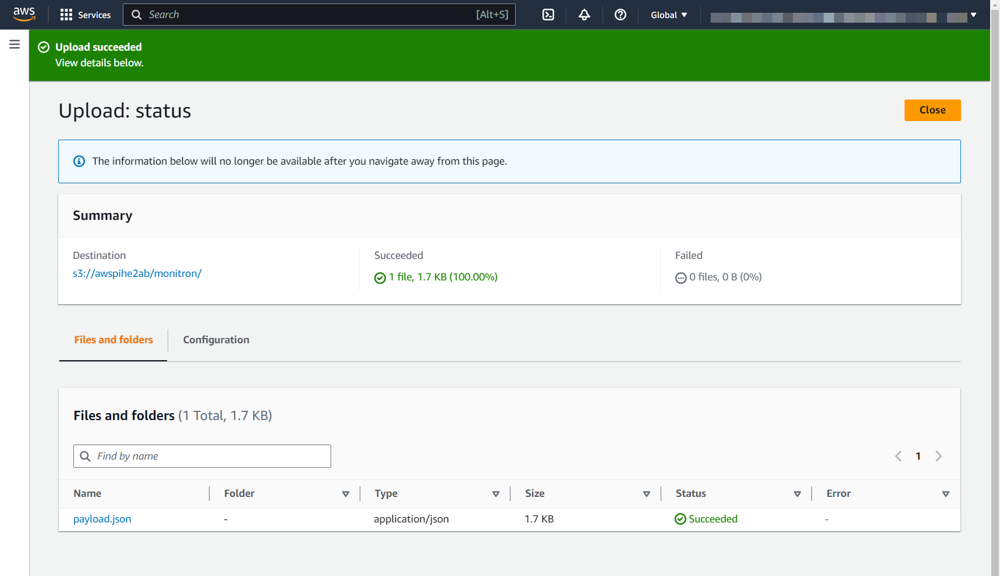
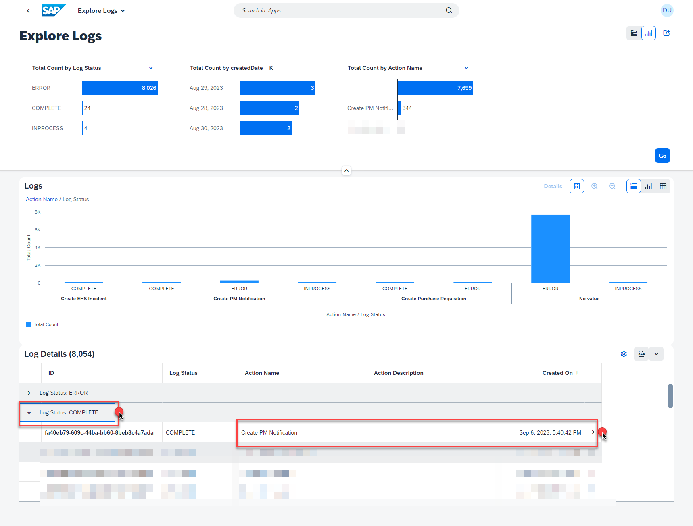
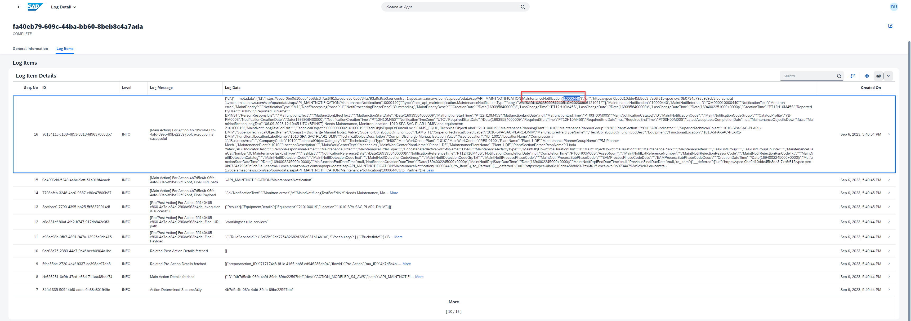
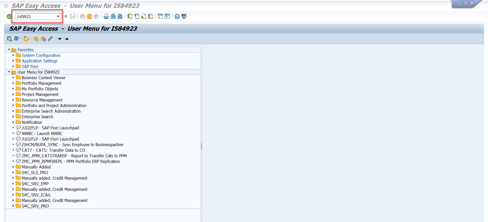
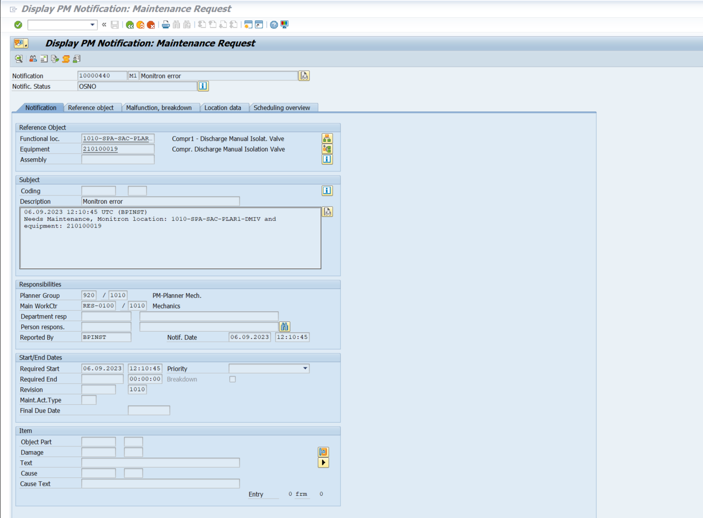

## Test the Extension Application and Execute the End-to-End Scenario

Now that you have successfully deployed the extension application in SAP BTP and completed the configurations in AWS, SAP BTP and SAP S/4HANA. 
From an SAP standpoint, we are only looking for inference data from Monitron. Without the actual hardware set up, This can be done in 2 ways
1) Use the [payload](/payload.txt) file as a sample to integrate into SAP.
2) Use the [Kinesis data generator](https://awslabs.github.io/amazon-kinesis-data-generator/web/producer.html) and use the [template file](/kinesisdatatemplate.json)  to simulate a kinesis stream.The sample [output file](/kinesissample.txt) contains a seriesof json documents.
3) AN S3 bucket is a prerequisite for both these scenarios.

We have followed the first approach, that is, using the [payload](/documentation/Step9-Test-ExtensionApplication/payload.txt) to test the scenario. Follow these steps to test the application.

1. Go to to your AWS account and Navigate to **S3** Service.

    

2. Choose the **S3 Bucket** named **awspihe2ab** 

    

3. Choose the folder named **monitron**

    

4. Download the **payload.txt** (payload.txt). This file has the sample event, which we use for testing the scenario. In the **monitron** folder, Choose **Upload**

    

5. Click on **Add files**, choose the **payload.txt** downloaded in the previous step. Choose **Upload**.

    

6. Upon the file upload, you should get a **Upload Succeeded** message

    

7. In the SAP BTP cockpit, navigate to your subaccount and choose **Cloud Foundry** > **Spaces**. Choose your space and then choose **action-management** application. Choose the url provided under **Application Routes** section.

    

8. Choose **Business Action Logs** Tile.

    

9. Under **Log Details**, click on the **Complete** to expand it. You should see a entry with **Create PM Notification**. **Click** on it to see the details.

    

10. Expand the **Log Data** of the **Log Message** that says **execution is successful** , and Copy the value of **ID** found in the paranthesis of **MaintenanceNotification('ID')**, **for example** : **MaintenanceNotification('10000440')**

    

11. To verify the creation of **PM Notification**, Log into **SAP S/4HANA GUI** System.

    

12. The code to **Display PM notification** is **/oIW23**. Enter this code and hit **Enter**.

    

13. In the **Display PM notification:Initial Screen**, Enter the value of ID copied from **Step 10** and hit **Enter**.

    

14. You should be able to see the **Display PM Notification: Maintenance Request** Screen, with the details of the event as follows:

    

You have completed the end-to-end integration of events to business actions from **Amazon Monitron** to **SAP S/4HANA** with **SAP BTP**.

